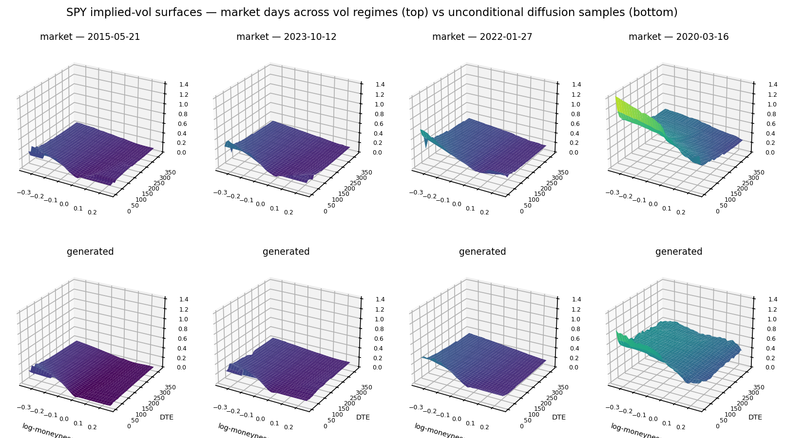
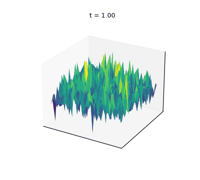
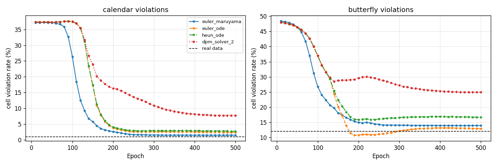
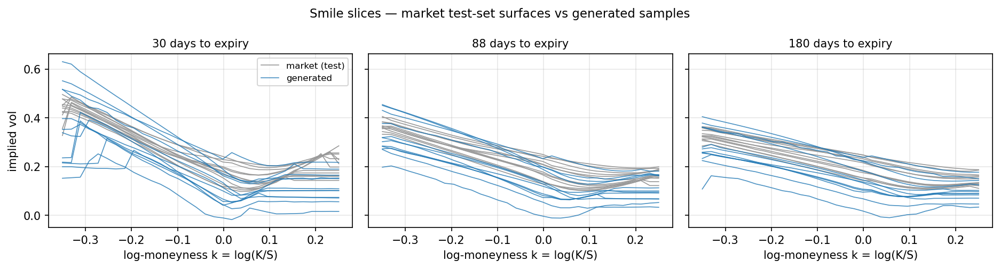
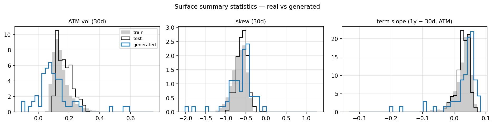
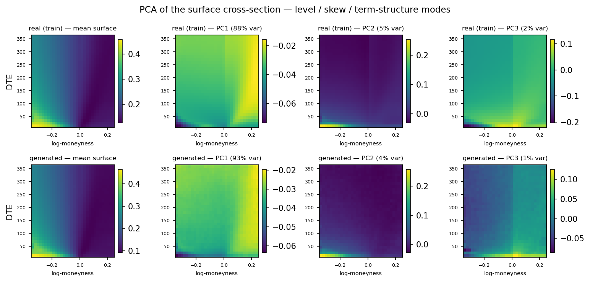
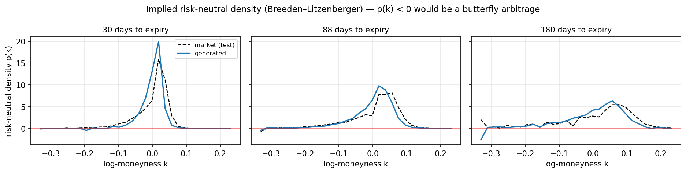

# Diffusion-Based Generative Modeling of the Implied Volatility Surface

A score-based diffusion model (VP-SDE, Song et al. 2021) trained on **3,500 daily SPY
implied-volatility surfaces (2010–2023)**, generating arbitrage-consistent surfaces from noise.
The model is never told the no-arbitrage conditions — it learns them from data: static-arbitrage
violation rates of generated surfaces converge toward the level of the market surfaces themselves.
Roadmap: benchmark against Heston / rough Bergomi calibration, then extend to DPS-style guided
sampling as a daily calibration tool (see [TODO](#todo)).


*Top: market surfaces across vol regimes, from a calm 2015 day to the COVID crash (2020-03-16).
Bottom: unconditional diffusion samples picked at the same quantiles of the vol distribution —
the model spans the same range of regimes, from low-vol smiles to inverted crisis surfaces.*

<p align="center"></p>
<p align="center"><em>Reverse diffusion: from Gaussian noise to a smooth vol surface
(probability-flow ODE, 500 steps).</em></p>

---

## Headline results

Static no-arbitrage checks (Gatheral & Jacquier 2014) on generated surfaces, in raw vol units:
**calendar** (total variance non-decreasing in maturity) and **butterfly** (Durrleman's
`g(k) ≥ 0`, i.e. non-negative risk-neutral density). The honest baseline is the *market* data
itself: the interpolated market surfaces violate these conditions at a measurable rate, so the
target is to match that level, not zero.

| Surfaces | Calendar cells violated | Butterfly cells violated |
|---|---|---|
| Market (interpolated, 3,500 days) | **1.6 %** | **10.0 %** |
| Diffusion — prob-flow ODE, 500 steps | 6.6 % | 12.2 % |
| Diffusion — Euler–Maruyama, 1000 steps | 4.3 % | 16.6 % |
| Diffusion — DPM-Solver-2, 100 steps | 18.8 % | 29.0 % |


*Violation rates of generated samples during training, per sampler, against the real-data level
(dashed). No arbitrage penalty is in the loss — the structure is learned from the data alone.*

---

## Sample quality & stylized facts

**Smiles.** Slices of generated surfaces vs held-out test-set market surfaces. The model
reproduces the short-dated skew, its flattening with maturity, and the OTM-call upturn:



**Cross-sectional statistics.** Distribution of per-surface summary stats — ATM level, 30-day
skew, ATM term-structure slope — for train, test and generated sets (64 samples; regenerate with
more via `uncond_inference.py --n_samples 512` for smoother histograms):



**PCA eigenmodes.** The classic decomposition of the surface cross-section (Cont & da Fonseca
2002): the generated set recovers the same mean surface and the same level / skew /
term-structure modes with closely matching explained-variance shares (PC1: 93 % vs 88 %):



**Implied risk-neutral density.** Breeden–Litzenberger densities extracted from a typical
generated surface vs a typical market surface. The generated density is well-shaped and almost
everywhere positive; the small negative dips at the far wings *are* the butterfly violations
quantified above — reported, not hidden:



All figures are produced by the `exp_*.py` scripts (see [Reproducing](#reproducing)).

---

## 1. Data

### Source

End-of-day SPY option chain snapshots, **2010–2023** (`data/SPY Options EOD Data (2010-2023) - raw`,
one parquet file per period). Each row is one option contract at the 4 PM close: quote date, spot
`S`, strike `K`, days-to-expiry (DTE), bid/ask/last, implied volatility and Greeks for both the
call and the put at that strike.

### Cleaning ([dataset.py](dataset.py) — `filter`)

For every contract we work with the **OTM side** of the book (puts for `K < S`, calls for `K > S`):
OTM options carry the liquidity and their quotes are the reliable ones. A quote is kept if:

| Filter | Value | Why |
|---|---|---|
| implied vol | `1e-3 < IV < 5.0` | discard failed BS inversions / data errors |
| two-sided quote | `bid > 0`, `ask ≥ bid` | quote must be tradable, not stale |
| relative spread | `(ask − bid)/mid < 1` | blown-out spreads carry no price information |
| maturity | `DTE ≥ 7` days | expiry-day quotes are pure noise (pin risk, 0DTE flows) |

The cleaned chain is cached to `data/spy_clean.parquet`.

### Surface construction ([dataset.py](dataset.py) — `create_surfaces`)

One surface per trading day on a fixed grid, cached to `data/iv_surfaces.pt` (**3 500 days**):

- **Axes:** log-moneyness `k = log(K/S) ∈ [−0.35, 0.25]` (≈ 0.70× to 1.28× spot) × maturity
  `DTE ∈ [7, 365]` days. The window covers the strikes that are actually quoted with tight
  spreads on SPY; beyond one year the chain becomes too sparse to interpolate honestly.
- **Resolution:** `32 × 32` (maturity × moneyness). Power of two so the UNet can down/upsample
  cleanly, and fine enough to resolve the short-dated skew.
- A day is kept only if it has **≥ 50 usable quotes** inside the window.
- IVs are interpolated onto the grid with **linear interpolation inside the convex hull** of the
  quotes and **nearest-neighbour fill at the edges** (`scipy.griddata`). Note: this interpolation
  does *not* enforce no-arbitrage — the real surfaces themselves violate the static-arbitrage
  conditions at a measurable rate, which is exactly the baseline the generative model is compared
  against (see the headline table).

### Split

**Chronological 80 / 10 / 10** (train / valid / test), never random: consecutive surfaces are
highly autocorrelated, so a random split would leak future regimes into training.

### Normalisation

Surfaces are **z-scored with train-set statistics only** (`mean ≈ 0.209`, `std ≈ 0.087`):

```
x_norm = (iv − iv_mean_train) / iv_std_train
```

An earlier version used min/max scaling to `[−1, 1]`; this was a mistake worth documenting: the
dataset maximum (IV ≈ 1.44) comes from a single crisis spike (March 2020) while typical IVs are
≈ 0.2, so min/max squashed the entire dataset into a thin sliver (std ≈ 0.12) of the range. The
diffusion prior is `N(0, I)` — the model had to collapse the prior into ~6 % of its variance, and
any residual network/sampler error was huge relative to the signal (visible as speckle in
generated surfaces). Z-scoring puts the data on the same unit-variance scale the prior and the
ε-target live on. `IVSurfaceDataset._denorm()` maps samples back to vol units.

---

## 2. Diffusion

### Formalism

Continuous-time score-based diffusion (Song et al. 2021) with the **variance-preserving (VP) SDE**
([sde.py](sde.py)):

$$dx = -\tfrac{1}{2}\beta(t)\,x\,dt + \sqrt{\beta(t)}\,dW,\qquad
\beta(t) = \beta_{min} + t(\beta_{max}-\beta_{min})$$

with `β_min = 1e-4`, `β_max = 20`, `T = 1` — the continuous-time match of the DDPM discrete
schedule (Ho et al. 2020). The marginals `p_t(x_t|x_0) = N(α(t)x_0, σ²(t)I)` are closed-form, so
training never simulates the SDE. A VE-SDE is implemented as well but unused: VP's bounded
variance suits data that is already standardised.

### ε-parameterisation

The UNet predicts the injected **noise ε**, not the score. The score is recovered analytically by
the `EpsilonScoreModel` wrapper ([sde.py](sde.py)):

$$s_\theta(x,t) = -\,\varepsilon_\theta(x,t)\,/\,\sigma(t)$$

**Why:** the DSM target score `−ε/σ(t)` blows up like `1/σ` as `t → 0` (magnitudes of 10³–10⁴ at
`t = 1e-4`) — a raw network output cannot track that, and the resulting small-`t` score error
shows up as pixel-level speckle in the samples. `ε ~ N(0, I)` is an O(1) regression target at
*every* `t`; the exact `1/σ` blow-up comes from the division instead of the network. The wrapper
is still score-valued, so the loss, all samplers and the DPS conditioning code are unchanged.
EMA and checkpoints operate on the raw UNet (the wrapper holds no parameters).

### Samplers ([sampler.py](sampler.py))

All samplers integrate the reverse dynamics from `t = T` to `t = ε ≈ 1e-4` and share one
interface; step counts are chosen for a comparable NFE budget:

| Sampler | Steps | NFE/step | Type |
|---|---|---|---|
| `euler_maruyama` | 1000 | 1 | reverse SDE (stochastic) |
| `euler_ode` | 500 | 1 | probability-flow ODE |
| `heun_ode` | 250 | 2 | ODE, 2nd order (trapezoidal) |
| `dpm_solver_2` | 100 | 2 | ODE, 2nd order exponential integrator in log-SNR space |

Empirically the three deterministic samplers coincide to ~5 decimals in MMD at these budgets
(discretisation error ≪ score error), while Euler–Maruyama's injected noise leaves samples
slightly grainier and biased; the ODE samplers are therefore preferred for evaluation. Every
sampler also supports DPS-style guidance hooks (`conditioning/`) for the posterior-sampling
extension.

---

## 3. Implementation

### Score network ([model/unet.py](model/unet.py))

The ADM / guided-diffusion UNet, adapted for small single-channel inputs: base width
`num_channels = 14` (≈ 580 k parameters), 1 residual block per level, automatic `channel_mult`
for the 32×32 input, self-attention at resolution 16, GroupNorm with scale-shift (adaptive) time
conditioning, EMA of the weights (decay 0.9999) used for all generation.

One non-obvious detail: continuous `t ∈ [0, 1]` is multiplied by **999** before the sinusoidal
timestep embedding (score_sde convention). The embedding was designed for integer steps 0–1000;
fed raw `t ∈ [0, 1]`, adjacent timesteps had cosine similarity 0.9996 — the network could barely
distinguish noise levels, which visibly degraded sample structure and diversity.

### Training loss ([loss.py](loss.py))

Denoising score matching with `x_t = α(t)x_0 + σ(t)ε`, `t ~ U([1e-4, 1])`:

$$\mathcal{L} = \mathbb{E}_{t,x_0,\varepsilon}\Big[\lambda(t)\,
\big\|\,s_\theta(x_t,t) + \varepsilon/\sigma(t)\,\big\|^2\Big]$$

with **min-SNR weighting** `λ(t) = min(σ²/α², 1)` (Hang et al. 2023). Written in score space the
weighting matters: combined with the ε-parameterisation it reduces analytically to (approximately)
the standard ε-MSE, well-conditioned at both ends of the time range. Weightings `likelihood`,
`snr` and `ones` are also implemented for comparison.

Optimisation: Adam, `lr = 2e-4`, 5-epoch linear warmup then `ReduceLROnPlateau` (×0.5, patience
10) on the validation loss, gradient clipping at norm 3.0, batch size 16, up to 500 epochs.

### Metrics tracked during training ([main.py](main.py))

Validation DSM loss selects `best_val.pt`. Every 10 epochs, 64 surfaces are generated with
**each** configured sampler (fixed seed 42, so grids are comparable across epochs *and* methods;
CPU+CUDA RNG state is restored afterwards) and scored two ways:

- **MMD** (RBF kernel, median-heuristic bandwidth) between generated and validation surfaces,
  per sampler — plotted together in `mmd.png`; each sampler keeps its own `best_mmd_{method}.pt`
  checkpoint. **Known issue:** this metric is currently misleading — see
  [Failure modes](#failure-modes--fixes).
- **Static-arbitrage violation rates**: **calendar** (total variance `w = σ²τ` non-decreasing in
  maturity) and **butterfly** (Durrleman's condition `g(k) ≥ 0`, i.e. non-negative risk-neutral
  density), on samples mapped back to vol units, plotted against the *real-data* violation level.

The training loss is a denoising objective and cannot measure sample quality by itself; the
arbitrage rates (and the stylized-fact checks above) are the metrics that decide which checkpoint
is "good".

## Reproducing

```bash
# 0. Clone and install dependencies
git clone https://github.com/LiamMry/expert-octo-barnacle.git
cd expert-octo-barnacle
pip install -r requirements.txt

# 1. Build the dataset cache (raw parquet → cleaned chain → 32×32 surfaces)
python dataset.py

# 2. Train (config in config/, outputs to trained_models_*/)
python main.py

# 3. Generate samples with each sampler (uses EMA weights)
python uncond_inference.py --ckpt trained_models_v3/best_val.pt --n_samples 64

# 4. README figures (assets/)
python exp_hero.py       # 3-D real-vs-generated surfaces + smile slices
python exp_stylized.py   # stylized-fact histograms, PCA modes, RN density
python exp_traj.py       # reverse-diffusion strip + GIF
```

Raw option data and trained checkpoints are not tracked in the repo.

---

## TODO

- [ ] **Benchmark against parametric baselines** — per-day Heston and rough Bergomi calibration
      on the same train/test split: repricing RMSE, arbitrage rates (parametric models are
      arbitrage-free by construction — a real disadvantage of the generative approach to report
      honestly), stability across consecutive days, and calibration wall-clock time.
- [ ] **Conditional inference with inpainted observations** — treat a day's observed quotes as a
      sparse mask over the grid and complete the surface by guided sampling (DPS hooks already in
      `conditioning/`): simulate generating the full IV surface from the first quotes of the day,
      and compare against direct calibration on the same quotes — including generalization to
      unquoted strikes/maturities.
- [ ] **Fix the MMD tracking metric** (bandwidth frozen on real data, or MMD on summary-stat /
      feature space) so checkpoint selection by sample quality actually works.
- [ ] Regenerate evaluation figures with more samples (`--n_samples 512`) for smoother
      distributional comparisons.
- [ ] Arbitrage-aware training (soft calendar/butterfly penalties in the loss) to close the
      remaining gap to the market's violation level.
- [ ] Conditioning on regime variables (realized vol, VIX level, date features) for
      scenario-conditional generation.
